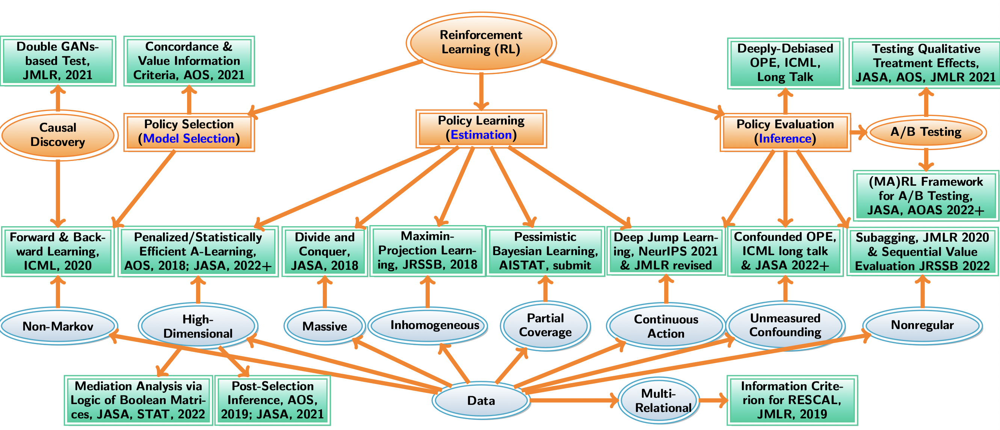

<!----->

### About

(i) I am assistant professor of the department of statistics at [London School of Economics and Political Science](http://www.lse.ac.uk/statistics) (LSE). 

(ii) Prior to (i), I was a Ph.D. student in [Statistics at North Carolina State University](https://www.stat.ncsu.edu/) (NCSU). I work with [Dr. Wenbin Lu](https://www4.stat.ncsu.edu/~lu/) and 
[Dr. Rui Song](https://www4.stat.ncsu.edu/~song/). 

(iii) Prior to (ii), I obtained a B.S. in Statistics from [Zhejiang University](https://www.zju.edu.cn/english/) in July 2014.

(iv) Prior to (iii), I graduated from [Ningbo Xiaoshi High School](https://en.wikipedia.org/wiki/Xiaoshi_Middle_School) in July 2010.

<!---I have a postdoc position funded by [EPSRC](https://gow.epsrc.ukri.org/NGBOViewGrant.aspx?GrantRef=EP/W014971/1&utm_source=BenchmarkEmail&utm_campaign=PhD_Newsletter_-_LT_Week_05_(2021%2f22)&utm_medium=email). See the post [here](https://jobs.lse.ac.uk/Vacancies/W/3537/0/335760/15539/research-officer-in-statistics).-->

I was honoured to receive the [Royal Statistical Society (RSS) Research Prize](https://rss.org.uk/news-publication/news-publications/2021/general-news/announcing-our-honours-recipients-for-2021/) in March 2021. 

I am looking for PhD students interested in reinforcement learning (see my lecture [slides](https://callmespring.github.io/teaching) on RL and my [slides](./slides/lecture11.pdf) on off-policy evaluation). 

My email <c.shi7@lse.ac.uk>. My [GitHub](https://github.com/callmespring). My [CV](./mycv-4.pdf).

### Research

My research is motivated from the applications in precision medicine, mobile health (simulated environments for [Diabetes](https://github.com/RunzheStat/TestMDP) and [Intern Health](https://github.com/limengbinggz/cusum-rl)), ridesharing (simulated environments for [Order Dispatch](https://github.com/callmespring/MDPOD) and [Spatio-temporal Policy Evaluation](https://github.com/RunzheStat/CausalMARL)) and neuroscience.

Some of my recent **talks** on statistical inference, RL and causal inference [StatRL](https://www.youtube.com/watch?v=-SW9PevZThs&t=982s), [CausalRL](https://www.youtube.com/watch?v=Zor1CmRyycw&t=397s).

A summary of my past/current research: **Statistical Methods in Reinforcement Learning**

### Editorial Service
* Associate editor, [Journal of the Royal Statistical Society, Series B](https://rss.onlinelibrary.wiley.com/journal/14679868) (Jan 2022 -- present)
* Associate editor, [Journal of Nonparametric Statistics](https://www.tandfonline.com/journals/gnst20) (Jan 2022 -- present)

