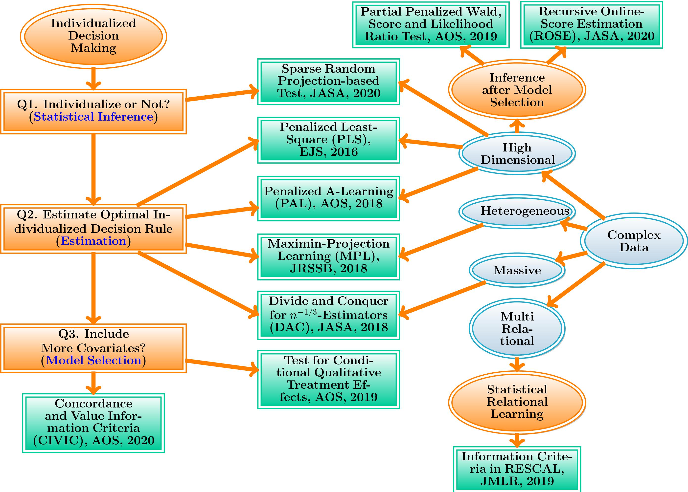

<!----->

### About

(i) I am assistant professor of the department of statistics at [London School of Economics and Political Science](http://www.lse.ac.uk/statistics) (LSE). 

(ii) Prior to (i), I was a Ph.D. student in [Statistics at North Carolina State University](https://www.stat.ncsu.edu/) (NCSU). I work with [Dr. Wenbin Lu](https://www4.stat.ncsu.edu/~lu/) and 
[Dr. Rui Song](https://www4.stat.ncsu.edu/~song/). 

(iii) Prior to (ii), I obtained a B.S. in Statistics from [Zhejiang University](https://www.zju.edu.cn/english/) in July 2014.

(iv) Prior to (iii), I graduated from [Ningbo Xiaoshi High School](https://en.wikipedia.org/wiki/Xiaoshi_Middle_School) in July 2010.

I have a postdoc position funded by [EPSRC](https://gow.epsrc.ukri.org/NGBOViewGrant.aspx?GrantRef=EP/W014971/1&utm_source=BenchmarkEmail&utm_campaign=PhD_Newsletter_-_LT_Week_05_(2021%2f22)&utm_medium=email). More details will be given later. 

I was honoured to receive the [Royal Statistical Society (RSS) Research Prize](https://rss.org.uk/news-publication/news-publications/2021/general-news/announcing-our-honours-recipients-for-2021/) in March 2021. 

I am looking for PhD students interested in reinforcement learning. 

My email address is: <c.shi7@lse.ac.uk>. My [GitHub](https://github.com/callmespring). My [CV](./mycv-4.pdf).

### Research Interests

My research is concentrated on

<!---* [statistical methods in precision medicine](research_pm)-->
* **reinforcement learning** (RL)
* analysis of **complex** data, including
  * neuroimaging data
  * DAG-structured data 
  * multi-relational data
  * massive data
  * high-dimensional data 

The motivation behind my work stems from real world applications. In medicine, applying RL algorithms could assist patients in improving their health status. In robotics, applying RL algorithms enables robots to learn complex behaviors in dynamically changing environments. In ride-sharing platforms, applying RL algorithms could increase its revenue and customer satisfaction. With the fast development of new technology, modern datasets often consist of massive observations, 
high-dimensional covariates and are characterized by some degree of heterogeneity. In an era of big and complex data, I'm interested in developing computationally efficient algorithms with statistical performance guarantees. 

A summary of my phase one research: **Individualized Decision Making with Complex Data**

### Editorial Service
* Associate editor, [Journal of the Royal Statistical Society, Series B](https://rss.onlinelibrary.wiley.com/journal/14679868) (Jan 2022 -- present)
* Associate editor, [Journal of Nonparametric Statistics](https://www.tandfonline.com/journals/gnst20) (Jan 2022 -- present)

