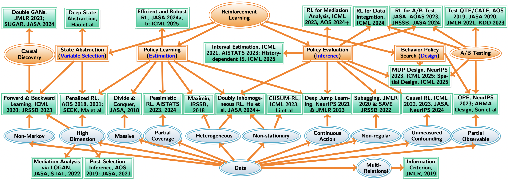

<!----->

### About

(i), I am an associate professor of data science at [London School of Economics and Political Science](http://www.lse.ac.uk/statistics) (LSE). 

(ii) Pior to (i), I was an assistant professor of data science at LSE. 

(iii) Prior to (ii), I was a Ph.D. student in Statistics at [North Carolina State University](https://www.stat.ncsu.edu/) (NCSU). I work with [Dr. Wenbin Lu](https://www4.stat.ncsu.edu/~lu/) and 
[Dr. Rui Song](https://song-ray.github.io/). 

(iv) Prior to (iii), I obtained a B.S. in Statistics from [Zhejiang University](https://www.zju.edu.cn/english/) in July 2014.

(v) Prior to (iv), I graduated from [Ningbo Xiaoshi High School](https://en.wikipedia.org/wiki/Xiaoshi_Middle_School) in July 2010.

<!---I have a postdoc position funded by [EPSRC](https://gow.epsrc.ukri.org/NGBOViewGrant.aspx?GrantRef=EP/W014971/1&utm_source=BenchmarkEmail&utm_campaign=PhD_Newsletter_-_LT_Week_05_(2021%2f22)&utm_medium=email). See the post [here](https://jobs.lse.ac.uk/Vacancies/W/3537/0/335760/15539/research-officer-in-statistics).-->

I was honoured to receive the [Institute of Mathematical Statistics (IMS) Tweedie Award](https://imstat.org/2024/03/05/chengchun-shi-receives-2024-ims-tweedie-new-researcher-award/) and the [Royal Statistical Society (RSS) Research Prize](https://rss.org.uk/news-publication/news-publications/2021/general-news/announcing-our-honours-recipients-for-2021/). 

I am looking for PhD students interested in reinforcement learning and large language models (LLMs); see my lecture [slides](https://github.com/callmespring/RL-short-course) on RL, our AAAI tutorial ([Youtube](https://www.youtube.com/watch?v=LwShOYaRFqM&list=PLA_E7IjY9cw4aC4T8pnV3vl9wSA1461KV), [Bilibili](https://www.bilibili.com/video/BV1ZS9NYpEHg/?spm_id_from=333.788.recommend_more_video.-1&vd_source=0ff25cf8645aa63231bec2428b94bf6f
)) on RL for two-sided marketplaces, my [slides](https://github.com/callmespring/RL-short-course/blob/main/Lecture%205/OPEslides.pdf) on off-policy evaluation and our review [paper](https://arxiv.org/pdf/2212.06355.pdf). 

My email <c.shi7@lse.ac.uk>. My [GitHub](https://github.com/callmespring). 

### Research

My research is motivated from the following applications: 
* **LLMs** (see our recent [paper](https://arxiv.org/pdf/2504.03784) on fine-tuning);
* **Ridesharing** (simulated environments for [Order Dispatch](https://github.com/callmespring/MDPOD) and [Spatio-temporal Policy Evaluation](https://github.com/RunzheStat/CausalMARL); see also our tutorial ([Youtube](https://www.youtube.com/watch?v=LwShOYaRFqM&list=PLA_E7IjY9cw4aC4T8pnV3vl9wSA1461KV), [Bilibili](https://www.bilibili.com/video/BV1ZS9NYpEHg/?spm_id_from=333.788.recommend_more_video.-1&vd_source=0ff25cf8645aa63231bec2428b94bf6f
)) and my [talk](https://www.bilibili.com/video/BV1yo4y1j7FU/?spm_id_from=333.337.search-card.all.click&vd_source=0ff25cf8645aa63231bec2428b94bf6f)); 
* **Video-sharing** (see our KDD [paper](https://dl.acm.org/doi/pdf/10.1145/3580305.3599809) for details about our proposal successfully deployed in a widely used mobile app with millions of daily active users)
* **Mobile health** (some simulated environments for [Diabetes](https://github.com/RunzheStat/TestMDP) and [Intern Health](https://github.com/limengbinggz/cusum-rl));
* **Neuroscience** (see our [paper](https://www.biorxiv.org/content/10.1101/2023.06.19.545524v1.full.pdf) on using RL for modelling human decision making)
* **Precision medicine** (a simulated [STARD](https://cran.r-project.org/web/packages/ITRSelect/index.html) data example).

Some of my recent **talks** and **slides** on statistical inference, RL, causal inference, data integration, time series and experimental design: 
* **StatRL** [Bilibili](https://www.bilibili.com/video/BV1ZP4y1r7DC/?spm_id_from=333.337.search-card.all.click&vd_source=0ff25cf8645aa63231bec2428b94bf6f), [Youtube](https://www.youtube.com/watch?v=-SW9PevZThs&t=982s); Chinese versions: [Bilibili](https://www.bilibili.com/video/BV1kP411f7dA/?spm_id_from=333.337.search-card.all.click), [Youtube](https://www.youtube.com/watch?v=7NWBLuok8nk&t=3048s); [slides](https://callmespring.github.io/slides/StatRL.pdf); the accompanying [paper](https://arxiv.org/abs/2502.16195)
* **CausalRL** [Youtube](https://www.youtube.com/watch?v=Zor1CmRyycw&t=397s), [slides](https://callmespring.github.io/slides/CausalRL.pdf); the accompanying [paper](https://arxiv.org/pdf/2002.01711)
* **ARMAdesign** [2-hour slides](https://callmespring.github.io/slides/ABtesting.pdf), [1-hour slides](https://callmespring.github.io/slides/ARMAdesign.pdf), [30-minute slides](https://callmespring.github.io/slides/design30m.pdf); the accompanying [paper](https://arxiv.org/pdf/2408.05342v3)
* **Pessimistic Data Integration** [slides](https://callmespring.github.io/slides/DataIntegration.pdf); the accompanying [paper](https://arxiv.org/pdf/2406.00317)
* **Doubly Inhomogeneous** [policy learning](https://callmespring.github.io/slides/DIRL.pdf), [policy evaluation](https://callmespring.github.io/slides/DIOPE.pdf). 

A summary of my past research: **Statistical Methods in Reinforcement Learning** (partly supported by [EPSRC](https://gow.epsrc.ukri.org/NGBOViewGrant.aspx?GrantRef=EP/W014971/1))

### Editorial Service
* Associate editor, [Annals of Applied Statistics](https://imstat.org/journals-and-publications/annals-of-applied-statistics/) (from Feb 2025)
* Associate editor, [Journal of the American Statistical Association, A&CS](https://www.tandfonline.com/journals/uasa20) (from Sep 2024)
* Associate editor, [Journal of the American Statistical Association, T&M](https://www.tandfonline.com/journals/uasa20) (Aug 2023 -- present)
* Associate editor, [Journal of the Royal Statistical Society, Series B](https://rss.onlinelibrary.wiley.com/journal/14679868) (Jan 2022 -- present)
* Associate editor, [Journal of Nonparametric Statistics](https://www.tandfonline.com/journals/gnst20) (Jan 2022 -- present)

